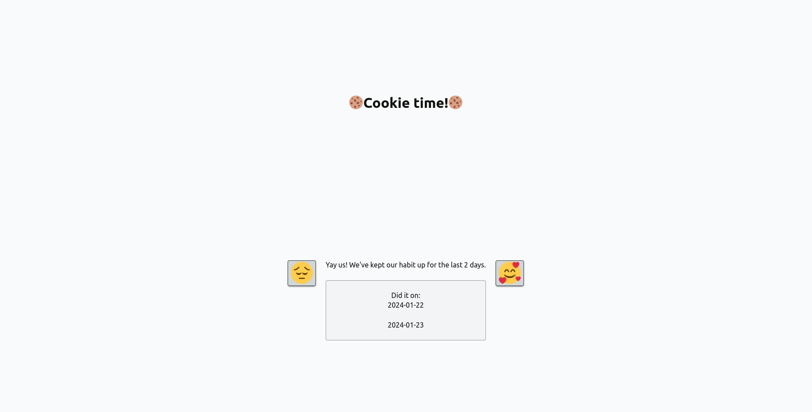

# Cohabit - collaborative habit tracker

Simple app to track habits with friends.
Built with HTMX/missing.style/Flask.



To run:

```bash
pip install -r requirements.txt # one-time
python serve.py
```
